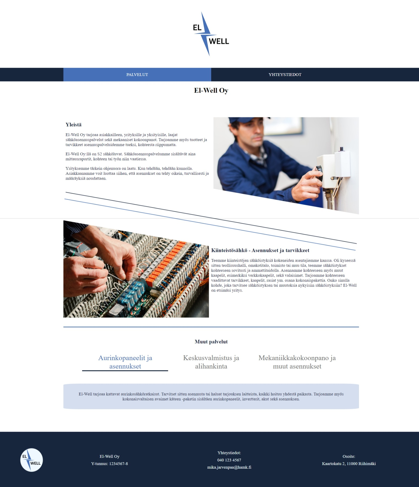
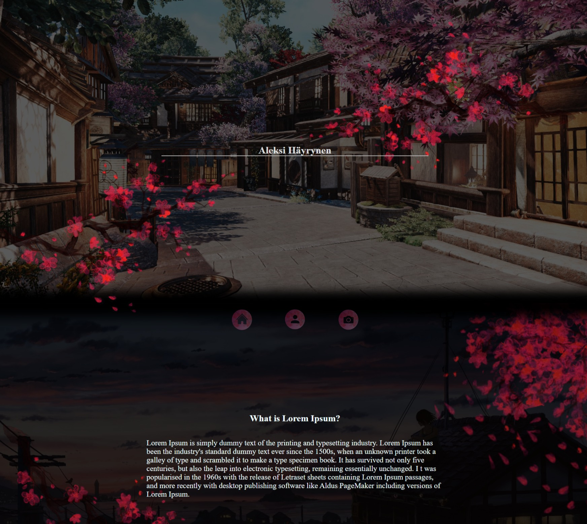
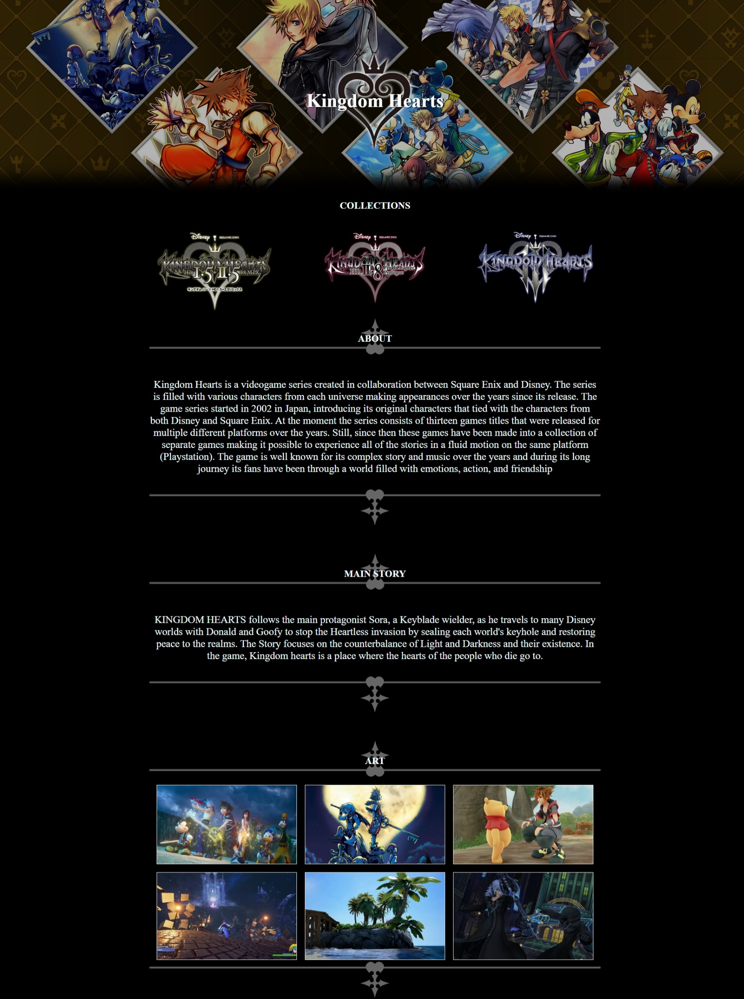

# HTML-CSS
Various websites for both school assignments and personal interests, exploring different styles and techniques along the way. These projects reflect my practice and experimentation in web development."
## Table of Contents
- [Yrityssivut](#yrityssivut)
- [Asset_customization](#asset_customization)
- [KH-responsive-design](#kh-responsive-design)

## Yrityssivut
We were given a task to design a potential website that would suit a real company. The website had to be responsive and have a stable/clean layout. I put effort into the responsives and styling this website making sure it felt like a real product. I also used some JS and Colour palettes on this website.

## Asset_customization
Wanted to try another layout style using 100vh blocks. Created/Modified a lot of the assets on this website like the background & navigation buttons. Not fully finished product and realized some problems this popular layout problem caused. The theme for the website was a small introduction about me with filler text.

## KH-responsive-design
Made a hobby website about an interest I had containing one of my favorite video games. Learned a lot about CSS and how to make things scale to different screen sizes. The website introduces a lot of the characters as pictures so managing all these different-sized pictures on different screen sizes was a fun way to practice. Overall like how the web page design turned out and was one of the 1st websites I worked on.

---
